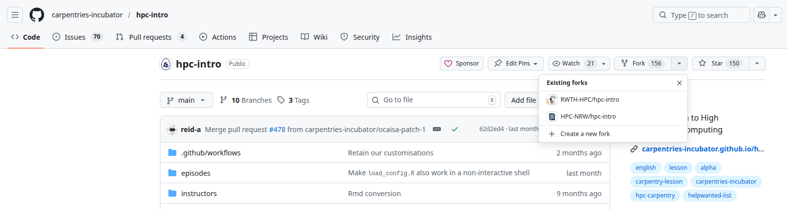
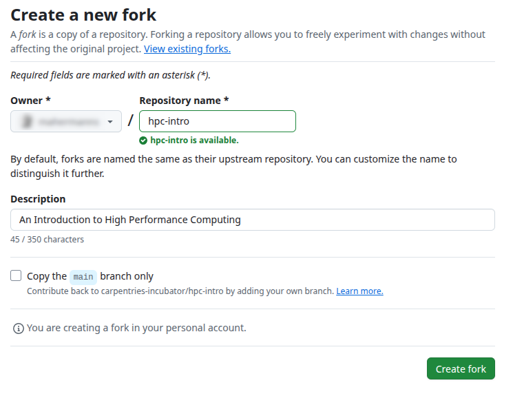
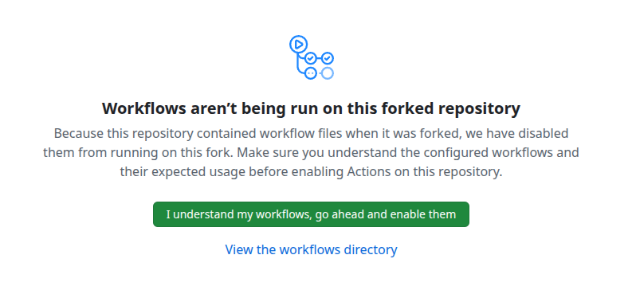
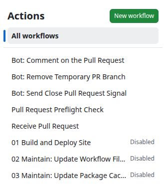
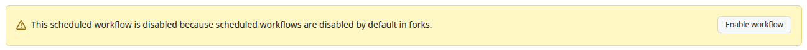
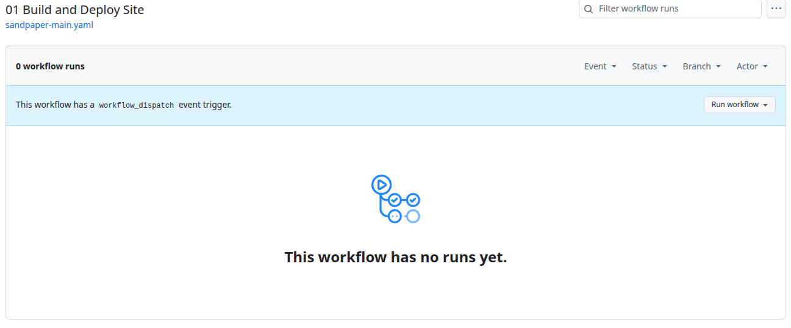
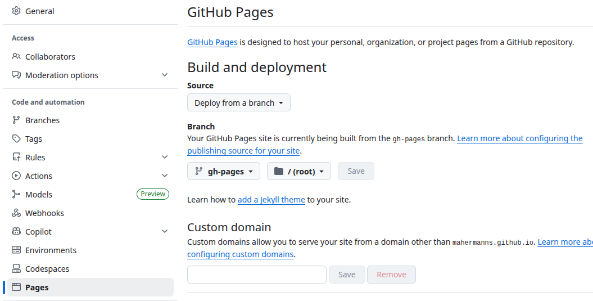

:::::::::::::::::::::::::::::::::::::: questions 

- What are the reasons for creating a fork of the material?
- What is the process required to prepare and maintain a fork of the material?
- How can I contribute back to upstream from a customized fork?

::::::::::::::::::::::::::::::::::::::::::::::::


::::::::::::::::::::::::::::::::::::: objectives

- Understand the necessity of forking the material.
- Familiarize yourself with the forking workflow.
- Decide on a branching model that supports customization as well as proposing updates to upstream.

::::::::::::::::::::::::::::::::::::::::::::::::

## Creating a Fork

To reduce cognitive load for learners during your workshop, you may want to customize the lesson materials. If customization is necessary before a workshop, it must be done on a separate fork of the lesson materials.

::::::::::::: prereq
The lesson materials are hosted on GitHub, utilizing an automatic build infrastructure powered by GitHub Actions. To follow the workflow described in this episode, you will need an **active GitHub account**.

Support for other Git hosting services and their CI infrastructures is currently not available.
::::::::::::::::::::



Using the pull-down menu next to the fork button allows you to start creating a fork.



The **owner** determines the URL of your generated materials. Choosing a location that reflects your hosting organization enhances recognizability and findability. If multiple customized versions are needed (e.g., adaptations for different HPC systems), consider customizing the **name** of your forked repository for clarity.

::::::::: callout
To ensure you replicate all auto-generated infrastructure, make sure that "Copy only `main` branch" option is **deselected** before creating your fork.
:::::::::::::::::

## Enabling GitHub Actions Workflows

As mentioned earlier, this repository contains GitHub Actions workflows. Since these workflows can execute commands on your behalf, they are disabled by default. To enable them, navigate to the **Actions** tab.



::::::::: caution
As with all security warnings, you should **verify** what actions will be performed by any code contained within GitHub Actions workflows or **trust** that HPC Carpentry has ensured no malicious code will run on your behalf.
:::::::::::::::::

After selecting **I understand my workflows; go ahead and enable them**, you'll arrive at an overview page where three workflows will be listed as disabled.



By selecting one of them, you'll see an informational message explaining why it was disabled.



Click **Enable Workflow** for each of these three workflows. Then select the **01 Build and Deploy Site** workflow.

Here, you'll find a **Run Workflow** button which allows you to manually initiate your first build and test out the infrastructure.



Once this initial workflow runs successfully, you've verified that everything is functioning correctly. Your rendered materials will then be accessible at `https://<your-owner-handle>.github.io/<hpc-intro-repo-name>`.

## Enabling GitHub Pages

Before publishing rendered web pages, you must enable GitHub Pages. In your **Settings** tab, select **GitHub Pages** from the left-side menu. Enable **Deploy from branch**, then choose the **gh-pages** branch.

Save this configuration; GitHub should begin deploying your rendered lesson automatically.



## Contributing Changes Back to Upstream Repository

Since workflows are enabled for your `main` branch without further intervention needed on your part, it is advisable to use this `main` branch for customization purposes. However, this affects how you can continue working with upstream versions of materials when proposing changes or improvements; you will not be able to base these proposals off your customized `main` branch since most customizations should remain within your downstream repository.

Nevertheless, it embodies Carpentries' spirit that materials undergo constant improvement through community contributions—these are explicitly welcomed!

:::::::::: callout
To facilitate cherry-picking changes from your customized `main` branch into branches intended for pull requests back upstream, keep individual commits small, self-contained, and distinct from general content customization.
::::::::::::::::::

To maintain easy access to future updates from upstream's `main` branch—which contains ongoing changes and additions—you need first to add HPC Carpentry's official repository as an additional remote in your cloned copy:

```sh
$ git remote add upstream https://github.com/carpentries-incubator/hpc-intro.git
```

With access established via `upstream`, create a new tracking branch (e.g., `upstream-main`) based on upstream's `main`:

```sh
$ git switch -c upstream-main upstream/main
```

You can then easily create branches containing suggested contributions intended for pull requests back into upstream using:

```sh
$ git switch upstream-main
$ git pull --rebase # The --rebase isn't strictly necessary since this branch won't contain any commits from you. It should always support fast-forward merges.
$ git branch <your-feature-branch>
$ git switch <your-feature-branch>
```

Keep both `your-feature-branch` and `main` updated by continuously rebasing against incoming changes from upstream's repository.

:::::::::: callout
The fewer modifications are made relative to official source material episodes, the easier maintenance will be when keeping content up-to-date.
::::::::::::::::::

::::::::::::::::::::::::::::::::::::: keypoints 

- When using cloud-based resources with Magic Castle installation, there is no need to fork materials.
- Fork if you wish or require customizations.
- Customizations can only be configured per specific site; different customizations necessitate separate forks.

::::::::::::::::::::::::::::::::::::::::::::::::