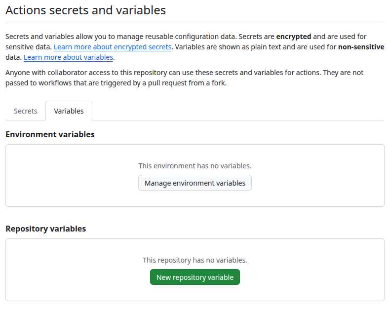
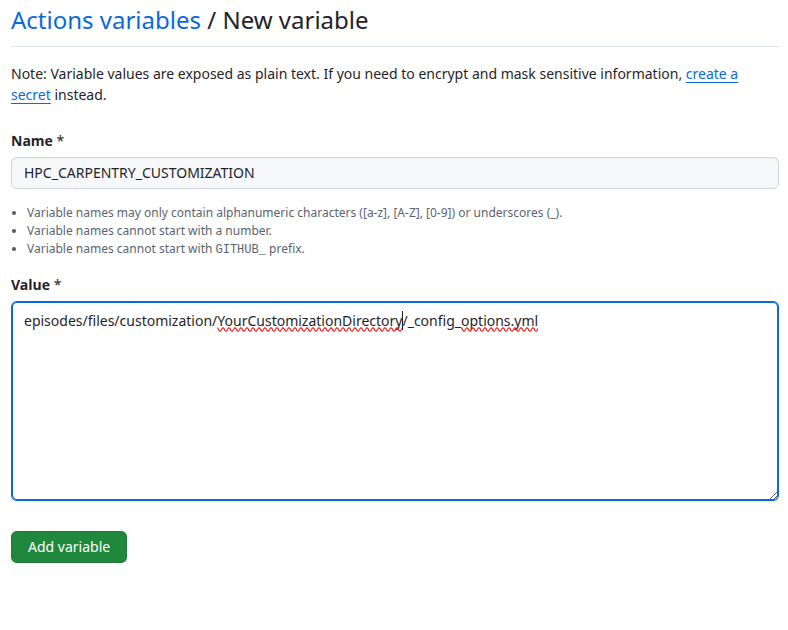

:::::::::::::::::::::::::::::::::::::: questions 

- What is the purpose of customizing the material?
- What are the different ways of customizing the material?
- Which best practices apply to customizing the material?

::::::::::::::::::::::::::::::::::::::::::::::::

::::::::::::::::::::::::::::::::::::: objectives

- Understand the purpose of customizing the material.
- Use the customization method best suited to a specific purpose.
- Apply best practices when customizing the material.

::::::::::::::::::::::::::::::::::::::::::::::::

::::::::: caution

The customization infrastructure is **not meant** for changing or adding **significant amounts of additional course content**.
You should always check whether the customizations you perform **serve to reduce cognitive load during and after the workshop**.

:::::::::::::::::

## Creating a repository for the customizations

The customization framework for the [Introduction to HPC][hpc-intro] lesson extends the standard [Carpentry Workbench][carpentry-workbench] infrastructure and works by using a **base template** and a **customization template**.
These templates are directories containing configuration and content text files that will be used when rendering the lesson material.

Customization can be done in two different ways:

1. By redefining a variable that is used in one or more places of the episode markdown, or
2. By providing a snippet file with the same name as the one used in the episodes.

The **base template** needs to define all *variables* and *snippets* used in the episodes.
The **customization template** can then selectively override any of those variables.
The lesson material already provides a complete base template with `HPCC_MagicCastle_slurm`, so you only need to create a customization template for your local adaptations.
Variables are often small strings of one or a few words, representing hostnames, commands, arguments, URLs, and similar items.
Snippets are larger text files that are inserted as-is into the Markdown source during the rendering process.


## Generating a customization directory

The customization files reside in the `episodes/files/customization` subfolder.
There you can find two subdirectories:

1. `HPCC_MagicCastle_slurm`, and
2. `Ghastly_Mistakes`.

The former is the **base template** provided by the HPC Carpentry organization that you can, and most likely should, use as the base for your customization.
It contains the customization for the cloud-based cluster installation based on Magic Castle using the Slurm scheduler.
The latter is an example customization for reference that contains values different from the base template to check whether the customization works in general.

To start your first customization, you have to create a new subdirectory for the configuration and snippets.

```sh
$ cd episodes/files/customization
$ mkdir YourCustomizationDirectory
```

You can do this either by creating a directory manually, or by including a Git submodule based off the [customization template][customization-template] provided by the HPC Carpentry.

This directory has to contain the configuration file `_config_options.yml`.
The minimal configuration contains the variable `snippets`, set to the directory name of your customization.

## Enabling the customization in the GitHub Actions workflow

To enable the use of this customization, you have to set the environment variable `HPC_CARPENTRY_CUSTOMIZATION` to the location of the customization configuration during the build process.

When you build the material locally, you can set the variable in the shell from which you start R to build the lesson material.

```sh
$ export HPC_CARPENTRY_CUSTOMIZATION=/full/path/to/episodes/files/customization/YourCustomizationDirectory/_config_options.yml
```

:::::::::: callout
Currently, the standard build process does not recognize changes in the customization configuration or the snippets. To get a clean build after changing anything in the customization, you need to **reset the site** by calling `sandpaper::reset_site()` and **trigger the build** with `sandpaper::build_lesson()`.

```sh
$ r -e "sandpaper::reset_site();sandpaper::build_lesson()"
```
::::::::::::::::::

To set this during the GitHub Actions workflow, you need to select *Secrets and variables* in the left menu of the *Settings* tab.
Then you select *Actions* and select the *Variables* tab.



There you set `HPC_CARPENTRY_CUSTOMIZATION` as a **Repository variable**.



This will then be passed to the build workflow.

## Customize via in-paragraph variables

You can modify individual variables in the `_config_options.yml` file of your customization.
You do not have to redefine all variables, so your customization config can list only the variables you want to change in the lesson.

::: callout
The hierarchy in variable names is important. Please ensure that you retain the variable hierarchy for the variables you do redefine.
:::::::::::

## Customize via 'snippets'

The following *snippets* are currently used in the episodes.
You can generate the current list of supported snippets in the `HPCC_MagicCastle_slurm/snippets` directory yourself like this:

```sh
$ HPCC_MagicCastle_slurm/snippets $ find . -type f
```
```output
cluster/queue-info.Rmd
cluster/specific-node-info.Rmd
scheduler/basic-job-status.Rmd
scheduler/runtime-exceeded-output.Rmd
scheduler/using-nodes-interactively.Rmd
scheduler/print-sched-variables.Rmd
scheduler/basic-job-script.Rmd
scheduler/option-flags-list.Rmd
scheduler/terminate-job-cancel.Rmd
scheduler/job-with-name-status.Rmd
scheduler/terminate-job-begin.Rmd
scheduler/terminate-multiple-jobs.Rmd
scheduler/runtime-exceeded-job.Rmd
parallel/one-task.Rmd
parallel/eight-tasks.Rmd
parallel/four-tasks.Rmd
modules/python-executable-dir.Rmd
modules/module-load-python.Rmd
modules/software-dependencies.Rmd
modules/missing-python.Rmd
modules/available-modules.Rmd
resources/account-history.Rmd
```
The files in `HPCC_MagicCastle_slurm` will always remain the reference customization in the repository.
The subdirectories of the snippet files correspond to the episode names they are used in.

They are usually the output from corresponding commands in the episodes and should be regenerated with the corresponding commands on the HPC system you customize for.

You only need to create the files (and subdirectories) for the snippets that you want to override.

::: caution
### Adding additional content

Sometimes you may need to add additional content to the lesson.
The current lesson curriculum has been tried and tested to fit into the 1-day (two half-days) schedule.
Adding significant content to the lesson material will likely skew the time needed to teach the lesson.
You should keep additional content to a minimum, expand the timeframe, and/or remove other content from the workshop.
:::::::::::

::::::::::::::::::::::::::::::::::::: keypoints 

- Any divergence from the core material introduces a maintenance debt.
- Use the recommended customization methods.
- Do not make significant additions to the material without adjusting the time available.
- Only customize what helps the learner match the in-class and out-of-class experience.

::::::::::::::::::::::::::::::::::::::::::::::::
