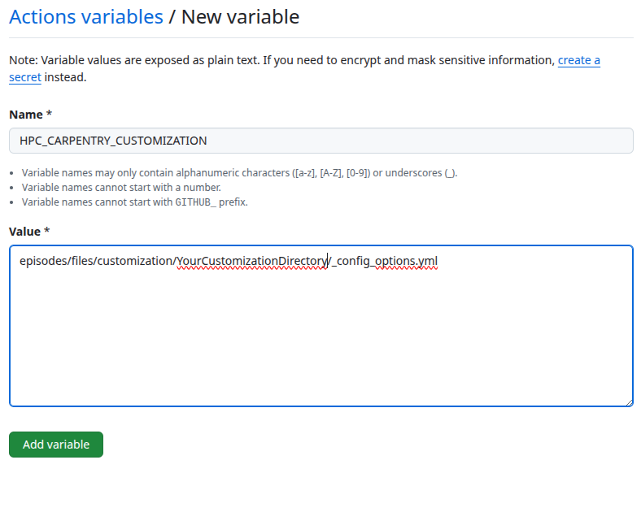

:::::::::::::::::::::::::::::::::::::: questions 

- What is the purpose of customizing the material?
- What are the different ways of customizing the material?
- Which best practices apply when customizing the material?

::::::::::::::::::::::::::::::::::::::::::::::::

::::::::::::::::::::::::::::::::::::: objectives

- Understand the purpose of customizing the material.
- Use the way of customization best suited for a specific purpose.
- Apply best practices when customizing the material.

::::::::::::::::::::::::::::::::::::::::::::::::

::::::::: caution
The customization infrastructure is **not meant** for changing or adding **signification amount of additional course content**.
You should always check whether the customizations you perform **serves the reduction of cognitive load during and after the workshop**.
:::::::::::::::::

## Creating a repository for the customizations

The customization framework for the [Introduction to HPC][hpc-intro] lesson, extending the standard [Carpentry Workbench][carpentry-workbench] infrastructure works by using a **base template** and a **customization template**.
These templates are directories containing configuration and content text files that will be used in the rendering of the lesson material.

Customization can be done in two different ways:

1. By re-defining a variable that is used in one or more places of the episode markdown, or
2. By providing a snippet file with the same name as in the 

The **base template** needs to define all *variables* and *snippets* used in the episodes.
The **customization template** can then override any of those variables selectively.
Variables are often small string of one or a few more words, representing hostnames, commands, arguments, URLs and the like.
Snippets are larger text files that are inserted as is into the markdown source during the rendering process.

:::::::: callout
You cannot use the special syntax for any of the callouts available in the Carpentry Workbench, however, you can use any other Markdown formatting options.
::::::::::::::::

## Generating a customization directory

The customization files reside in the `episodes/files/customization` subfolder.
There you can find two subdirectories:

1. `HPCC_MagicCastle_slurm`, and
2. `Ghastly_Mistakes`.

The former is the **base template** provided by the HPC Carpentry organization that you can and most likely should use as the base for your customization.
It contains the customization for the cloud-based cluster installation based on Magic Castle using the Slurm scheduler.
The latter is an example customization for reference that contains values different from the base template to check whether the customization works in general.

To start your first own customization you have to create a new subdirectory for the configuration and snippets.

```sh
$ cd episodes/files/customization
$ mkdir YourCustomizationDirectory
```


This directory has to contain the configuration file `_config_options.yml`.
The minimal configuration contains the variable `snippets`, set to the directory name of your customization.

## Enabling the customization in the Github Actions Workflow

To enable the use of this customization you have to set the environment variable `HPC_CARPENTRY_CUSTOMIZATION` to the location of the customization configuration during the build process.

When you are building the material locally you can just set the variable in your building shell from which you start R to build the lesson material.

```sh
$ export HPC_CARPENTRY_CUSTOMIZATION=episodes/files/customization/YourCustomizationDirectory/_config_options.yml
```

:::::::::: callout
Currently, the standard build process does not recognize changes in the customization configuration or the snippets. To get a clean build after changing anything in the customization, you need to **reset the site** with calling `sandpaper::reset_site()` and **trigger the build** with `sandpaper::build_lesson()`.

```sh
$ r -e "sandpaper::reset_site();sandpaper::build_lesson()"
```
::::::::::::::::::

To set this during the Github Actions Workflow you need to select *Secrets and variables* in the left menu of the *Settings* tab.
Then you select *Actions* and select the *Variables* tab.


There you set `HPC_CARPENTRY_CUSTOMIZATION` as a **Repository variable**.



This will then be passed to the build workflow.

## Customize via in-paragraph variables

You can modify single variables in the `_config_options.yml` file of your customization.
You do not have to re-define all variables, so your customization config can only list the variables you want to change in the lesson.

::: callout
The hierarchy in variable names is important. Please ensure that you retain the variable hierarchy for the variables you do re-define.
:::::::::::

## Customize via 'snippets'

The following *snippets* are currently used in the episodes.
You can generate the current list of support snippets in the `HPCC_MagicCastle_slurm/snippets` directory yourself like this:

```sh
$ HPCC_MagicCastle_slurm/snippets $ find . -type f
```
```output
cluster/queue-info.Rmd
cluster/specific-node-info.Rmd
scheduler/basic-job-status.Rmd
scheduler/runtime-exceeded-output.Rmd
scheduler/using-nodes-interactively.Rmd
scheduler/print-sched-variables.Rmd
scheduler/basic-job-script.Rmd
scheduler/option-flags-list.Rmd
scheduler/terminate-job-cancel.Rmd
scheduler/job-with-name-status.Rmd
scheduler/terminate-job-begin.Rmd
scheduler/terminate-multiple-jobs.Rmd
scheduler/runtime-exceeded-job.Rmd
parallel/one-task.Rmd
parallel/eight-tasks.Rmd
parallel/four-tasks.Rmd
modules/python-executable-dir.Rmd
modules/module-load-python.Rmd
modules/software-dependencies.Rmd
modules/missing-python.Rmd
modules/available-modules.Rmd
resources/account-history.Rmd
```
The files in `HPCC_MagicCastle_slurm` will always remain the repository reference customization.
The subdirectory of the snippet files correspond to the episode names they are used in.

They are usually output from corresponding commands in the episodes and should be regenerated with the corresponding commands on the HPC system you customize for.
You only need to create the files (and subdirectories) for the snippets that you want to override.

::: caution
### Adding additional content

Sometimes it can be necessary to add additional content to the lesson.
The current lesson curriculum has been tried and tested to fit into the 1-day (two half-days) schedule.
Adding significant content to the lesson material will likely skew the time needed to teach the lesson.
You should keep additional content to the lesson to a minimum, expand the timeframe, and/or remove other content from the workshop.
:::::::::::

::::::::::::::::::::::::::::::::::::: keypoints 

- Any divergence from the core material introduces a maintenance dept.
- Use the proposed ways of customization.
- Do not make significant additions to the material without adjusting the time available.
- Only customize what helps the learner in matching the in-class and out-of-class experience.

::::::::::::::::::::::::::::::::::::::::::::::::
